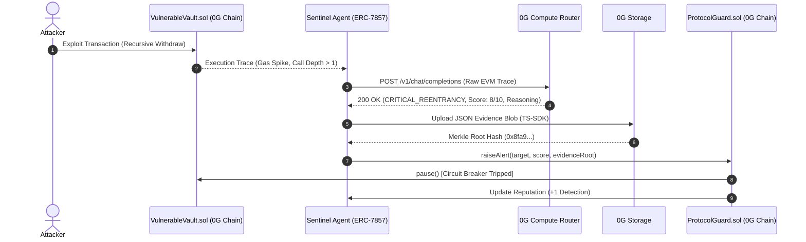

# 🛡️ Hashly — Hackathon Submission Story & Technical Overview

---

## 🚀 What it does

**Hashly** is an autonomous, decentralized AI security network that continuously protects DeFi protocols against real-time exploits. Instead of relying on passive off-chain alerts, Hashly acts as an automated cryptographic immune system built natively across the **0G Network**:

1. **Autonomous Exploit Detection:** Intercepts suspicious transactions (reentrancy loops, flash loan price manipulations, oracle deviation attacks, unauthorized state access) and sends their raw execution traces to **0G Compute** for zero-shot classification with sub-second latency.
2. **Decentralized Forensic Storage:** Automatically hashes transaction calldata, execution call-depths, and AI reasoning logs, permanently anchoring them into **0G Storage** via the `@0gfoundation/0g-storage-ts-sdk` to produce tamper-proof Merkle proofs.
3. **Instant On-Chain Circuit Breakers:** When a threat score reaches the critical threshold ($\ge 7/10$), Hashly executes on-chain transaction calls to `ProtocolGuard.sol` on the **0G Galileo Testnet**, automatically tripping the circuit breaker and pausing the vulnerable smart contract before attacker extraction can complete.
4. **Evolving ERC-7857 Agentic IDs:** Security sentinels exist as ownable on-chain NFT identities. Each agent possesses custom security specializations and system prompts, accumulating on-chain reputation for verified detections and advancing through evolutionary tiers: **Scout $\to$ Guardian $\to$ Warden $\to$ Overlord**.

---

## ⚡ The problem it solves

In DeFi, security is fundamentally asynchronous:
* **Audits are static:** A smart contract audit is a snapshot in time; it cannot prevent runtime economic exploits or novel zero-day attack vectors.
* **Alerting is too slow:** Existing monitoring tools (OpenZeppelin Defender, Tenderly, Forta bots) send webhook alerts to Telegram or Discord channels. By the time a security engineer wakes up, reads the alert, and signs a multi-sig transaction to pause a vault (typically 15 to 45 minutes), the attacker has already drained the pool and bridged the funds away.
* **Centralization risk:** Traditional automated emergency shutoffs rely on centralized AWS lambdas holding private keys with zero transparency or verifiable proof.

**How Hashly Solves It:**
Hashly closes the loop between **AI inference**, **data verification**, and **on-chain execution**. By executing AI inference on decentralized 0G Compute and linking it directly to on-chain circuit breakers on 0G Chain with permanent forensic records on 0G Storage, Hashly reduces response times from **30 minutes to under 2 seconds** — stopping exploits in the same block.

---

## 🛠️ Technologies I used

### 1. 0G Full-Stack Infrastructure
* **0G Chain (Galileo Testnet, Chain ID 16602):** High-speed EVM layer executing smart contracts (`SentinelRegistry.sol`, `ProtocolGuard.sol`, and target vaults).
* **0G Compute Router:** Decentralized AI inference running `qwen2.5-omni` / Llama-4-Scout models via OpenAI-compatible endpoints with provider billing and execution trace tracking.
* **0G Storage:** Decentralized blob storage utilizing `@0gfoundation/0g-storage-ts-sdk` to anchor forensic JSON evidence payloads and generate on-chain Merkle root proofs.
* **ERC-7857 Standard:** Emerging Ethereum standard for Agentic IDs, enabling tokenized, transferable, and stateful AI agent identities.

### 2. Frontend & Web3 Interface
* **Next.js 15 (App Router & Turbopack):** High-performance server-rendered and static frontend architecture.
* **Wagmi v2 & Viem v2:** React hooks and type-safe EVM client with custom multi-RPC fallback transports.
* **RainbowKit:** Wallet connection modal with 0G Galileo network integration.
* **Custom Glassmorphic Design System:** Minimalist dark HUD interface with live vector telemetry consoles, real-time threat heatmaps, and interactive pipeline diagrams.

### 3. Smart Contracts & Tooling
* **Solidity 0.8.20:** Reentrancy-guarded smart contracts with OpenZeppelin v5 primitives.
* **Hardhat:** Compilation, deployment scripts, and local testing harness.
* **Ethers.js v6:** Server-side RPC provider and backend deployer transaction signing.

---

## 🔧 How we built it

1. **Smart Contract Architecture:**
   * Wrote `SentinelRegistry.sol` implementing ERC-7857 Agentic IDs with dynamic metadata URIs, system prompts, specializations, and on-chain reputation advancement logic.
   * Built `ProtocolGuard.sol` as the circuit breaker registry managing protocol registrations, alert dispatching, and emergency pauses.
   * Created `VulnerableVault.sol` with an intentional reentrancy vulnerability to act as a live demo target.
2. **0G Compute Pipeline (`/api/analyze`):**
   * Built a server-side route that takes EVM call parameters (gas delta, internal call depth, value transferred, price slippage), constructs structured prompts, and queries the 0G Compute Router API.
   * Formatted zero-shot security prompts that output structured JSON threat classifications and natural-language explanations.
3. **0G Storage Evidence Vault (`/api/storage`):**
   * Integrated `@0gfoundation/0g-storage-ts-sdk` into Next.js backend routes using Node.js buffers and Blob APIs.
   * Converted attack forensic payloads into Merkle tree structures, uploading them directly to 0G Storage nodes and returning verified root hashes.
4. **Interactive Simulation Harness & UI:**
   * Developed `Simulate.js` with live streaming terminal logs showcasing the entire lifecycle: Transaction intercepted $\to$ 0G Compute classified $\to$ 0G Storage anchored $\to$ On-chain pause executed.
   * Engineered the `Dashboard.js` and `Sentinels.js` interfaces to pull 100% live state from 0G Galileo without placeholder data.

---

## 🧗 Challenges I ran into

1. **0G Storage TS-SDK Peer Dependency Conflicts:**
   * *Problem:* `@0gfoundation/0g-storage-ts-sdk` strictly required `ethers@6.13.1` and had peer dependencies that conflicted with Next.js 15 and `@coinbase/cdp-sdk`.
   * *Solution:* Resolved package resolutions in `package.json`, configured `next.config.mjs` with Webpack alias stubs and `serverExternalPackages`, allowing the 0G Storage SDK to run smoothly in server-side API routes.
2. **EVM JSON-RPC 2.0 Compatibility:**
   * *Problem:* When submitting contract write transactions via MetaMask on viem 2.x, the default 0G RPC endpoint returned `Version of JSON-RPC protocol is not supported` when wallets were mismatched or batching was enabled.
   * *Solution:* Configured a resilient `fallback()` transport in `wagmi.js` across official 0G RPC, Ankr RPC, and dRPC endpoints with `batch: false`. Added automatic network detection and 1-click **"Switch to 0G Galileo"** prompts in the UI.
3. **0G Compute 402 Billing & Model Availability:**
   * *Problem:* When testing initial calls, the 0G Compute Router returned `402 Insufficient Balance` because testnet compute tokens had not been assigned to the API key. Additionally, model endpoints differ across testnet clusters.
   * *Solution:* Built dynamic model resolution targeting `qwen2.5-omni` on the integrate network cluster, with complete error transparency logging provider addresses (`0xa48f...`), token usage, and billing costs in the execution terminal.
4. **Contract Calldata Encoding for ERC-7857 Metadata:**
   * *Problem:* Storing rich agent metadata (descriptions, system prompts, specializations) on-chain without incurring excessive gas costs.
   * *Solution:* Encoded structured agent metadata into compact base64 data URIs stored directly in the `metadataURI` field of each Agentic ID token.

---

## 💡 What we learned

* **0G's Modular Architecture is a Game-Changer for Autonomous Agents:** Bringing together decentralized compute, ultra-cheap permanent storage, and high-throughput EVM execution within a unified network allows AI agents to act as truly autonomous on-chain actors without relying on centralized Web2 cloud dependencies.
* **ERC-7857 Transforms AI Agents into Financial Assets:** Tokenizing security agents with mutable on-chain reputation creates a powerful economic incentive loop where agent creators are rewarded for building high-accuracy threat detectors.
* **Real-Time DeFi Security Must Be Proactive:** Detecting attacks at the mempool/execution stage and triggering deterministic on-chain pauses is the only viable paradigm to outpace MEV bots and automated flash loan exploiters.

---

## 🔮 What's next for Hashly

### 🚀 Wave 2: Swarm Consensus & Headless Sentinel Daemons
* **Multi-Agent Swarm Consensus:** Implement threshold voting where $\ge 3$ independent Sentinel agents must cross-verify an exploit before triggering a global protocol pause.
* **Headless Sentinel Node Daemon (CLI & Docker):** Release an open-source daemon (Rust/Node.js) that node runners and DeFi protocol operators can run 24/7 to listen to 0G mempool WebSocket events.
* **zk-Inference Verification:** Integrate zero-knowledge proofs (zkML) on 0G to cryptographically prove that the AI model execution on 0G Compute was unmodified before on-chain execution.
* **`@hashly/guard` SDK:** A 1-line Solidity modifier (`modifier hashlyProtected`) for any DeFi protocol on 0G to instantly inherit autonomous circuit breaker protection.

### 🌐 Wave 3: Cross-Chain Settlement & Agent Marketplace
* **Cross-Chain Emergency Pauses:** Utilize 0G's cross-chain interoperability to allow Sentinels on 0G Network to trigger emergency circuit breakers on Ethereum Mainnet, Arbitrum, and Base.
* **Decentralized Sentinel Marketplace:** Buy, rent, stake, and compose high-reputation ERC-7857 Sentinels with on-chain revenue sharing.
* **$OG Staking & Slashing Mechanism:** Require sentinels to stake $OG tokens to earn detection bounties, slashing stakes for unverified false alarms to guarantee high-fidelity alerts.
* **AI Exploit Patch Synthesizer:** Automatically generate verified Solidity hot-fix pull requests and security patches stored on 0G Storage alongside forensic incident reports.
