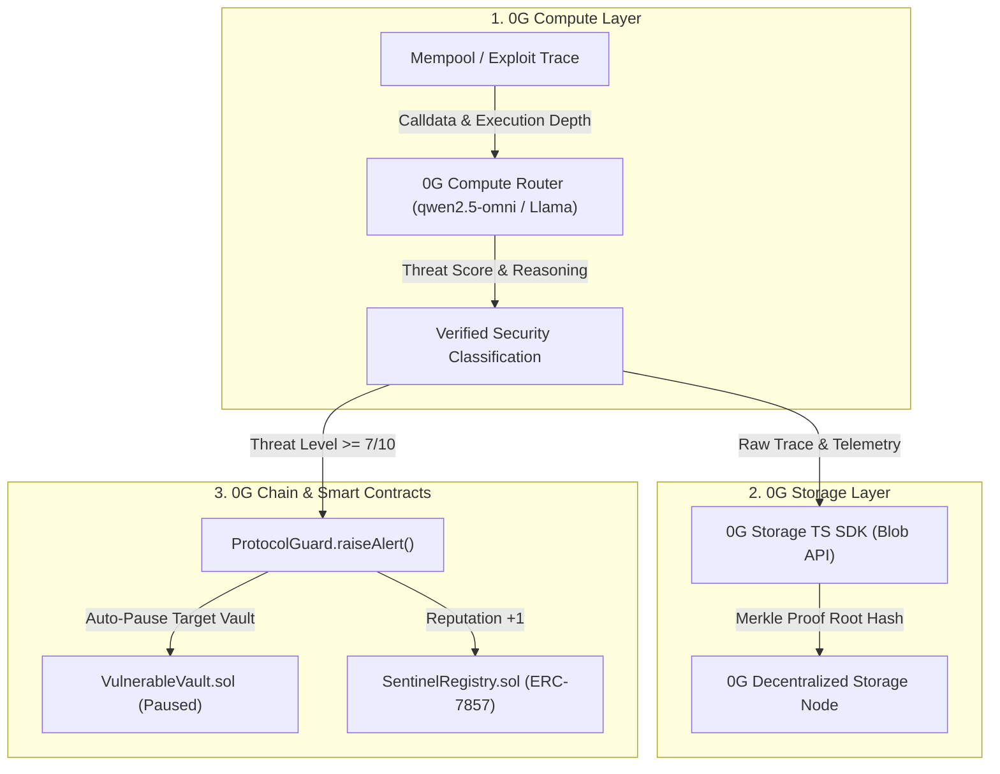

# Hashly - Autonomous AI DeFi Security & Circuit Breaker Network

> **Autonomous AI security agents that detect, analyze, and neutralize DeFi smart contract exploits in real time, tokenized as ERC-7857 Agentic IDs on 0G Network.**

[-indigo.svg)](https://chainscan-galileo.0g.ai)
[](https://docs.0g.ai)
[](https://docs.0g.ai)
[](https://eips.ethereum.org)
[](LICENSE)

Built for the **0G Bridge Buildathon by AKINDO** — Wave 1 Submission.

---

## One-Liner Description

**Hashly is an autonomous on-chain security network that intercepts DeFi exploits in real time using 0G Compute for AI threat classification, 0G Storage for immutable evidence anchoring, and ERC-7857 Agentic IDs for automated circuit breakers on 0G Chain.**

---

## Detailed Project Description

DeFi exploits cause over **$2 Billion in losses annually**. When reentrancy, flash loan price manipulation, or oracle drift occurs, the attack executes in seconds. Traditional security solutions rely on off-chain human monitoring and alerts (Discord/Telegram bots) which take 15 to 45 minutes to triage — far too late to stop an exploit.

**Hashly** replaces passive alerts with an autonomous, verifiable, closed-loop security infrastructure built natively on the **0G Network**:

1. **Sub-Second Threat Classification (0G Compute):** Transaction execution traces (gas spikes, call stack depth, state delta anomalies) are classified in real time by decentralized AI models running on the **0G Compute Router**.
2. **Immutable Forensic Storage (0G Storage):** Complete exploit telemetry, trace data, and model inference results are cryptographically hashed and anchored into **0G Storage** via the official 0G Storage TS-SDK.
3. **Automated On-Chain Circuit Breakers (0G Chain):** If an exploit threat level exceeds safety thresholds ($\ge 7/10$), Hashly executes on-chain transaction calls to `ProtocolGuard.sol` on 0G Galileo Testnet, pausing the vulnerable contract instantly within the same execution block.
4. **Decentralized Agentic Identities (ERC-7857):** Security agents are ownable, transferable, and evolving on-chain assets. Each Sentinel accumulates reputation on 0G Chain based on verified detections, advancing through tiers: **Scout $\to$ Guardian $\to$ Warden $\to$ Overlord**.

---

## Full-Stack 0G Integration

Hashly is built from the ground up to utilize all four core pillars of the 0G modular AI ecosystem:



| 0G Technology | Hashly Integration Details |
|---|---|
| **0G Compute Router** | Sub-second decentralized inference via OpenAI-compatible endpoint (`qwen2.5-omni` / Llama-4-Scout) to classify exploit signatures (reentrancy, flash loan manipulation, oracle drift, access control breaches). |
| **0G Storage** | Uploads tamper-proof JSON evidence blobs containing raw execution traces, model reasoning, and timestamps using `@0gfoundation/0g-storage-ts-sdk`. Returns on-chain verifiable Merkle root hashes. |
| **0G Chain (Galileo)** | High-throughput EVM blockchain (Chain ID `16602`) hosting `SentinelRegistry.sol`, `ProtocolGuard.sol`, and protected vaults with $<2\text{s}$ confirmation times. |
| **ERC-7857 Standard** | On-chain Agentic IDs with dynamic metadata URIs, behavioral system prompts, security specializations, and on-chain reputation tiering. |

---

## Deployed Smart Contracts (0G Galileo Testnet — Chain ID: 16602)

| Contract | Address on 0G Galileo | Description |
|---|---|---|
| **SentinelRegistry** (ERC-7857) | [`0x01F9d2D5A4eA2BA7139D599b4f6B6D06cCB34bcE`](https://chainscan-galileo.0g.ai/address/0x01F9d2D5A4eA2BA7139D599b4f6B6D06cCB34bcE) | Tokenized Agentic IDs with custom system prompts, specialization tracking, and on-chain reputation advancement. |
| **ProtocolGuard** (Circuit Breaker) | [`0x6224d82ab9bE92d4eCF116D8cafC13d078B83aFC`](https://chainscan-galileo.0g.ai/address/0x6224d82ab9bE92d4eCF116D8cafC13d078B83aFC) | Autonomous security hub that verifies threats, triggers emergency circuit-breaker pauses on target contracts, and updates sentinel reputation. |
| **VulnerableVault** (Demo Protocol) | [`0x67717afbCa0c2A4E060B2Ef0621bF33ef07908C5`](https://chainscan-galileo.0g.ai/address/0x67717afbCa0c2A4E060B2Ef0621bF33ef07908C5) | Live DeFi vault contract deployed on 0G Galileo containing a reentrancy vector to demonstrate active protection and autonomous pausing. |

---

## Buildathon Roadmap

### Wave 1: Core Architecture & Live On-Chain Integration (Current)
- [x] **Smart Contract Suite:** Deployed `SentinelRegistry` (ERC-7857), `ProtocolGuard`, and `VulnerableVault` to 0G Galileo Testnet.
- [x] **0G Compute Integration:** Live zero-shot DeFi exploit classification via 0G Compute Router (`qwen2.5-omni` with usage/billing trace telemetry).
- [x] **0G Storage Integration:** Live upload of forensic audit records and evidence JSONs via `@0gfoundation/0g-storage-ts-sdk`.
- [x] **ERC-7857 Agent Minting:** Configurable on-chain agent deployment with custom security specialization (Reentrancy, Flash Loan, Oracle, Access Control) and system prompts.
- [x] **Interactive Simulator:** End-to-end exploit simulator demonstrating mempool interception $\to$ 0G Compute $\to$ 0G Storage $\to$ On-chain circuit-breaker pause.
- [x] **Production dApp:** Dark, institutional security interface built with Next.js 15, RainbowKit, Wagmi, and multi-RPC fallback support.

---

### Wave 2: Swarm Consensus & Decentralized Sentinel Daemons
- [ ] **Sentinel Swarm Consensus:** Multi-agent voting mechanism where $\ge 3$ independent Sentinel Agentic IDs must corroborate high-severity alerts before triggering global circuit breakers.
- [ ] **Background Node Daemon (CLI / Docker):** Open-source headless sentinel runner (Rust/Node.js) that protocol operators can run locally to monitor mempool transactions via WebSocket RPC.
- [ ] **Zk-Proof Verification on 0G:** Integrating zero-knowledge inference proofs verifying that 0G Compute model outputs have not been tampered with before triggering circuit breakers.
- [ ] **Custom Protocol SDK (`@hashly/guard`):** A 1-line Solidity modifier `hashlyProtected` and npm package for third-party protocols on 0G to plug into the sentinel network.

---

### Wave 3: Cross-Chain Settlement & Agent Marketplace
- [ ] **Cross-Chain Circuit Breakers:** Cross-chain messaging to allow Sentinels on 0G Network to trigger emergency pauses on Ethereum, Arbitrum, and Base.
- [ ] **ERC-7857 Agent Marketplace:** Decentralized marketplace to buy, rent, stake, and compose high-reputation Sentinel agents.
- [ ] **Bounty & Slash Staking:** Staking mechanism where sentinel operators stake $OG tokens to earn detection bounties and face slashing for unverified false alarms.
- [ ] **Automated Exploit Patch Synthesizer:** AI-generated Solidity hot-fix patches stored on 0G Storage alongside exploit reports.

---

## Quickstart & Local Setup

### Prerequisites
- Node.js 20+
- MetaMask or any EVM wallet
- 0G Galileo Testnet tokens from [0G Faucet](https://faucet.0g.ai)

### Installation

```bash
# 1. Clone repository
git clone https://github.com/ayush035/Hashly.git
cd Hashly

# 2. Install dependencies
npm install

# 3. Configure environment variables
cp .env.example .env.local
```

### Environment Configuration (`.env.local`)

```env
# 0G Galileo Testnet RPC
ZG_TESTNET_RPC=https://evmrpc-testnet.0g.ai

# 0G Compute Router
ZG_COMPUTE_API_KEY=your_funded_0g_compute_key
ZG_COMPUTE_BASE_URL=https://router-api-testnet.integratenetwork.work/v1

# 0G Storage
ZG_STORAGE_RPC=https://storage-testnet.0g.ai

# Deployer Key (for automated backend alert triggering & storage gas)
PRIVATE_KEY=your_private_key

# Contracts on 0G Galileo (Chain ID: 16602)
NEXT_PUBLIC_SENTINEL_REGISTRY=0x01F9d2D5A4eA2BA7139D599b4f6B6D06cCB34bcE
NEXT_PUBLIC_PROTOCOL_GUARD=0x6224d82ab9bE92d4eCF116D8cafC13d078B83aFC
NEXT_PUBLIC_VULNERABLE_VAULT=0x67717afbCa0c2A4E060B2Ef0621bF33ef07908C5
```

### Run Locally

```bash
npm run dev
# Open http://localhost:3000
```

---

## Tech Stack

| Layer | Technology |
|---|---|
| **Frontend Framework** | Next.js 15 (App Router, Turbopack) |
| **Web3 & Wallet** | Wagmi v2, Viem v2, RainbowKit |
| **AI Inference** | 0G Compute Router (`qwen2.5-omni` / Llama-4-Scout) |
| **Data Storage** | 0G Decentralized Storage (`@0gfoundation/0g-storage-ts-sdk`) |
| **Smart Contracts** | Solidity 0.8.20, Hardhat |
| **Blockchain** | 0G Galileo Testnet (Chain ID `16602`) |
| **Agent Token Standard** | ERC-7857 (Agentic IDs) |

---

## License

MIT License — see [LICENSE](LICENSE) for details.

---

<p align="center">
  Built with on <a href="https://0g.ai"><strong>0G Network</strong></a> for the <strong>0G Bridge Buildathon</strong>
</p>
