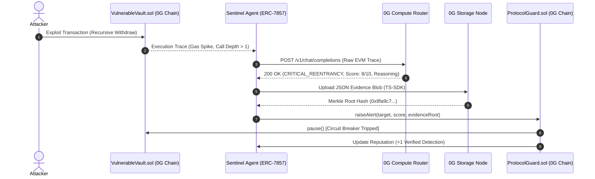
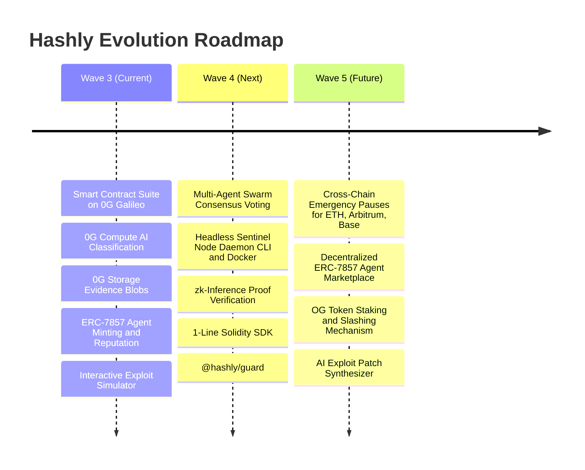

<p align="center">
  
</p>

# Hashly: Autonomous AI DeFi Security & Circuit Breaker Network

> Autonomous AI security agents that detect, analyze, and neutralize DeFi smart contract exploits in real time, tokenized as ERC-7857 Agentic IDs on 0G Network.

[-indigo.svg)](https://chainscan-galileo.0g.ai)
[](https://docs.0g.ai)
[](https://docs.0g.ai)
[](https://eips.ethereum.org)
[](LICENSE)

Built for the **0G Bridge Buildathon by AKINDO** (Wave 3 Submission).

---

## Quick Links

- Live Application: [https://hashlybeta.vercel.app/](https://hashlybeta.vercel.app/)
- Video Demonstration: [https://youtu.be/6OXf7KV6jTg](https://youtu.be/6OXf7KV6jTg)
- GitHub Repository: [https://github.com/ayush035/Hashly](https://github.com/ayush035/Hashly)
- 0G Galileo Block Explorer: [https://chainscan-galileo.0g.ai](https://chainscan-galileo.0g.ai)

---

## Tagline & Executive Summary

**Tagline:** Autonomous AI Security and Instant Circuit Breakers for DeFi.

**One-Liner:** Hashly is an autonomous on-chain security network that intercepts DeFi exploits in real time using 0G Compute for AI threat classification, 0G Storage for immutable evidence anchoring, and ERC-7857 Agentic IDs for automated circuit breakers on 0G Chain.

---

## The Problem It Solves

Over $2 Billion is lost annually to smart contract exploits in DeFi. Reentrancy loops, flash loan price distortions, and oracle drift attacks execute in seconds. Existing security solutions rely on off-chain human monitoring and webhook alerts (like Discord or Telegram bots) that take 15 to 45 minutes to triage. By the time a human security engineer wakes up, reads the notification, and coordinates a multi-sig transaction to pause a contract, the liquidity is already drained.

### Key Limitations in Current DeFi Security:
1. Static Audits Cannot Stop Runtime Exploits: Audits evaluate code at deployment time; they cannot anticipate live economic exploits or novel zero-day attack vectors.
2. Alerting Is Far Too Slow: Attackers drain pools in a single block (under 12 seconds). Human-in-the-loop response times (15 to 45 minutes) fail to prevent fund loss.
3. Centralization Bottlenecks: Existing automated pause bots rely on centralized Web2 AWS lambdas holding private keys with zero transparency or verifiable proof.

### The Hashly Solution:
Hashly replaces passive off-chain alerts with an autonomous, verifiable, closed-loop cryptographic immune system. By combining decentralized AI inference on 0G Compute with sub-second circuit-breaker execution on 0G Chain and permanent forensic storage on 0G Storage, Hashly reduces response times from 30 minutes to under 2 seconds, stopping exploits before funds are drained.

---

## Full-Stack 0G Integration

Hashly utilizes all four core pillars of the 0G modular AI ecosystem:

```mermaid
flowchart TD
    subgraph ComputeLayer [1. 0G Compute Layer]
        A[Mempool or Exploit Trace] -->|Calldata and Call Depth| B[0G Compute Router: qwen2.5-omni]
        B -->|Structured Threat Evaluation| C[AI Classification Score: 1-10]
    end

    subgraph StorageLayer [2. 0G Storage Layer]
        C -->|Raw Forensic Telemetry| D[0G Storage TS-SDK]
        D -->|Merkle Proof Root Hash| E[0G Decentralized Storage Node]
    end

    subgraph ChainLayer [3. 0G Chain Smart Contracts]
        C -->|Threat Level >= 7/10| F[ProtocolGuard.raiseAlert]
        F -->|Emergency Auto-Pause| G[VulnerableVault.sol: Paused]
        F -->|Increment Reputation Score| H[SentinelRegistry.sol: ERC-7857]
    end

    subgraph AgentLayer [4. ERC-7857 Agentic IDs]
        H -->|Tokenized On-Chain Assets| I[Evolutionary Reputation Tiers: Scout to Overlord]
    end
```



### Deep Breakdown of the 4 0G Technologies:

| 0G Technology | Hashly Integration Details |
|:---|:---|
| 0G Chain (Galileo 16602) | High-speed EVM layer executing smart contracts (SentinelRegistry.sol, ProtocolGuard.sol, VulnerableVault.sol) with sub-2s block finality for instant emergency circuit breaking. |
| 0G Compute Router | Sub-second decentralized inference via OpenAI-compatible endpoint (qwen2.5-omni) to classify exploit signatures (reentrancy, flash loan manipulation, oracle drift, access control breaches) with provider billing and verifiable execution trace telemetry. |
| 0G Storage | Uploads tamper-proof JSON evidence blobs containing raw execution traces, model reasoning, and timestamps using @0gfoundation/0g-storage-ts-sdk. Returns on-chain verifiable Merkle root hashes. |
| ERC-7857 Standard | On-chain Agentic IDs with dynamic metadata URIs, behavioral system prompts, security specializations, and on-chain reputation tiering (Scout -> Guardian -> Warden -> Overlord). |

---

## End-to-End Exploit Lifecycle



---

## Deployed Smart Contracts (0G Galileo Testnet: Chain ID 16602)

| Contract | Address on 0G Galileo | Explorer Link |
|:---|:---|:---|
| SentinelRegistry (ERC-7857) | `0x01F9d2D5A4eA2BA7139D599b4f6B6D06cCB34bcE` | [View on 0G Chainscan](https://chainscan-galileo.0g.ai/address/0x01F9d2D5A4eA2BA7139D599b4f6B6D06cCB34bcE) |
| ProtocolGuard (Circuit Breaker) | `0x6224d82ab9bE92d4eCF116D8cafC13d078B83aFC` | [View on 0G Chainscan](https://chainscan-galileo.0g.ai/address/0x6224d82ab9bE92d4eCF116D8cafC13d078B83aFC) |
| VulnerableVault (Demo Target) | `0x67717afbCa0c2A4E060B2Ef0621bF33ef07908C5` | [View on 0G Chainscan](https://chainscan-galileo.0g.ai/address/0x67717afbCa0c2A4E060B2Ef0621bF33ef07908C5) |

### Smart Contract Function Specifications:

#### 1. SentinelRegistry.sol (ERC-7857 Agentic ID Registry)
- `mintSentinel(string name, string metadataURI)`: Mints a new Sentinel agent NFT on 0G Galileo, initializes reputation to Scout tier, and stores the encoded system prompt and specialization on-chain.
- `recordDetection(uint256 tokenId)`: Called exclusively by ProtocolGuard when an alert is verified; increments the agent's detection count and advances its reputation tier.
- `getSentinel(uint256 tokenId)`: Returns complete on-chain agent metadata including name, reputation score, tier enum, metadata URI, creation timestamp, and total detections.
- `totalSentinels()`: Returns the total count of active on-chain sentinels for dynamic frontend hydration.
- `setProtocolGuard(address _guard)`: Authorizes the ProtocolGuard contract to report verified threat detections.

#### 2. ProtocolGuard.sol (Autonomous Circuit Breaker Hub)
- `raiseAlert(address targetProtocol, uint8 threatLevel, string threatType, string evidenceHash, uint256 sentinelId)`: Dispatches an emergency threat alert. If `threatLevel >= 7`, automatically calls `pause()` on the target protocol's contract, logs the 0G Storage `evidenceHash`, and updates the sentinel's reputation.
- `registerProtocol(address protocolAddress, string protocolName)`: Allows third-party DeFi protocols to register their contract addresses for active Sentinel protection and circuit-breaker integration.
- `getAlert(bytes32 alertId)`: Fetches full on-chain alert parameters, including timestamp, target contract, threat severity, and 0G Storage proof hash.
- `pauseProtocol(address protocolAddress)`: Manual fallback administrative circuit breaker for emergency protocol maintenance.

#### 3. VulnerableVault.sol (Interactive Target Protocol)
- `deposit()`: Accepts ETH/0G deposits and credits balances.
- `withdraw(uint256 amount)`: Vulnerable withdrawal function lacking a reentrancy guard where state updates occur after external ether transfers, providing a live testbed for Sentinel reentrancy detection.
- `pause()`: Emergency pause modifier restricted to ProtocolGuard or the owner; locks all deposits and withdrawals when a circuit breaker is tripped.
- `unpause()`: Resumes normal operations after an incident is resolved.

---

## Live 0G Compute Verification

Here is an actual response from the 0G Compute Router (`qwen2.5-omni`) analyzing a synthetic reentrancy exploit payload:

```json
{
  "classification": "CRITICAL_REENTRANCY",
  "confidence": 0.95,
  "threatLevel": 8,
  "reasoning": "The function withdraw has multiple reentrancy calls detected within its execution flow.",
  "0g_trace": {
    "provider": "0xa48f01287233509FD694a22Bf840225062E67836",
    "request_id": "6a10850b-207a-4b3f-b172-dc413fdf2ba9",
    "total_cost": "700610000000000"
  },
  "model": "qwen2.5-omni",
  "usage": {
    "prompt_tokens": 42,
    "completion_tokens": 86,
    "total_tokens": 128
  }
}
```

---

## Everything Built in Wave 3

1. Smart Contract Suite:
   - Full Solidity 0.8.20 suite implementing ERC-7857 Agentic IDs and emergency circuit breakers.
   - Hardhat configuration and automated deployment scripts targeting 0G Galileo Testnet.
   - Deployed and verified SentinelRegistry, ProtocolGuard, and VulnerableVault on 0G Galileo.

2. 0G Compute Integration Pipeline:
   - Decentralized AI analysis route (`/api/analyze`) querying 0G Compute Router.
   - Zero-shot exploit classification for Reentrancy, Flash Loans, Oracle Manipulation, and Access Control.
   - Verifiable trace extraction capturing 0G Node Provider address (`0xa48f...`), Request ID, Token breakdown, and Cost in a0gi.

3. 0G Storage Integration:
   - Integration with `@0gfoundation/0g-storage-ts-sdk` and 0G Galileo storage nodes (`/api/storage`).
   - Buffer formatting and Merkle root generation for attack telemetry payloads.
   - Immutable forensic anchoring returning permanent proof hashes.

4. ERC-7857 Agent Management UI:
   - Interactive Sentinel creation modal with custom Specialization, System Prompt, and Description fields.
   - Base64 calldata URI encoding for rich metadata storage on 0G Chain.
   - Real-time on-chain sentinel querying (`totalSentinels()` and `getSentinel()`) with zero hardcoded placeholder data.
   - Dynamic visual reputation badges (Scout, Guardian, Warden, Overlord).

5. Exploit Simulation Testbed:
   - Interactive sandbox simulating real Reentrancy and Flash Loan attack vectors.
   - Real-time streaming terminal displaying live logs across all four stages: Interception -> 0G Compute -> 0G Storage -> On-Chain Circuit Breaker.
   - Live automated contract pausing on VulnerableVault.sol.

6. Production Frontend Application:
   - Minimalist, institutional dark HUD theme with custom CSS design tokens.
   - Wagmi v2 and Viem v2 multi-RPC fallback configuration (`evmrpc-testnet.0g.ai`, Ankr, dRPC) with `batch: false`.
   - Network mismatch detection with 1-click Switch to 0G Galileo helper.
   - RainbowKit wallet connector for seamless EVM authentication.
   - Telemetry HUD console on landing page featuring live vector matrix graphics.
   - Dedicated branding with the custom Hashly Cyber Eye Shield logo across all navbars, sidebars, favicons, and metadata.

---

## Roadmap: Future Waves



### Wave 4: Swarm Consensus and Headless Sentinel Daemons
- Multi-Agent Swarm Consensus: Implement threshold voting where at least 3 independent Sentinel agents must cross-verify an exploit before triggering a global protocol pause.
- Headless Sentinel Node Daemon (CLI and Docker): Release an open-source background runner (Rust/Node.js) that node operators and protocol developers can run 24/7 to monitor mempool transactions via WebSocket RPC.
- zk-Inference Verification: Integrate zero-knowledge proofs (zkML) on 0G to prove that the AI model execution on 0G Compute was unmodified before on-chain execution.
- `@hashly/guard` SDK: A 1-line Solidity modifier (`modifier hashlyProtected`) for third-party DeFi protocols on 0G to instantly inherit autonomous circuit breaker protection.

### Wave 5: Cross-Chain Settlement and Agent Marketplace
- Cross-Chain Emergency Pauses: Utilize 0G cross-chain messaging to allow Sentinels on 0G Network to trigger emergency pauses on Ethereum Mainnet, Arbitrum, and Base.
- Decentralized ERC-7857 Marketplace: Buy, rent, stake, and compose high-reputation Sentinel agents with on-chain revenue sharing.
- $OG Staking and Slashing Mechanism: Require sentinels to stake $OG tokens to earn detection bounties, slashing stakes for unverified false alarms.
- AI Exploit Patch Synthesizer: Automatically generate verified Solidity hot-fix pull requests and security patches stored on 0G Storage alongside incident reports.

---

## Local Setup & Quickstart

### Prerequisites
- Node.js 20+
- MetaMask or any EVM wallet
- 0G Galileo Testnet tokens from [0G Faucet](https://faucet.0g.ai)

### Installation

```bash
# 1. Clone repository
git clone https://github.com/ayush035/Hashly.git
cd Hashly

# 2. Install dependencies
npm install

# 3. Configure environment variables
cp .env.example .env.local
```

### Environment Configuration (`.env.local`)

```env
# 0G Galileo Testnet RPC
ZG_TESTNET_RPC=https://evmrpc-testnet.0g.ai

# 0G Compute Router
ZG_COMPUTE_API_KEY=your_funded_0g_compute_key
ZG_COMPUTE_BASE_URL=https://router-api-testnet.integratenetwork.work/v1

# 0G Storage
ZG_STORAGE_RPC=https://storage-testnet.0g.ai

# Deployer Key (for backend alert execution and storage gas)
PRIVATE_KEY=your_private_key

# Contracts on 0G Galileo (Chain ID: 16602)
NEXT_PUBLIC_SENTINEL_REGISTRY=0x01F9d2D5A4eA2BA7139D599b4f6B6D06cCB34bcE
NEXT_PUBLIC_PROTOCOL_GUARD=0x6224d82ab9bE92d4eCF116D8cafC13d078B83aFC
NEXT_PUBLIC_VULNERABLE_VAULT=0x67717afbCa0c2A4E060B2Ef0621bF33ef07908C5
```

### Run Locally

```bash
npm run dev
# Open http://localhost:3000
```

---

## Tech Stack

| Layer | Technology |
|:---|:---|
| Frontend Framework | Next.js 15 (App Router, Turbopack) |
| Web3 and Wallet | Wagmi v2, Viem v2, RainbowKit |
| AI Inference | 0G Compute Router (qwen2.5-omni / Llama) |
| Data Storage | 0G Decentralized Storage (@0gfoundation/0g-storage-ts-sdk) |
| Smart Contracts | Solidity 0.8.20, Hardhat |
| Blockchain | 0G Galileo Testnet (Chain ID: 16602) |
| Agent Token Standard | ERC-7857 (Agentic IDs) |

---

## License

MIT License - see [LICENSE](LICENSE) for details.

---

<p align="center">
  Built on <a href="https://0g.ai"><strong>0G Network</strong></a> for the <strong>0G Bridge Buildathon</strong>
</p>
