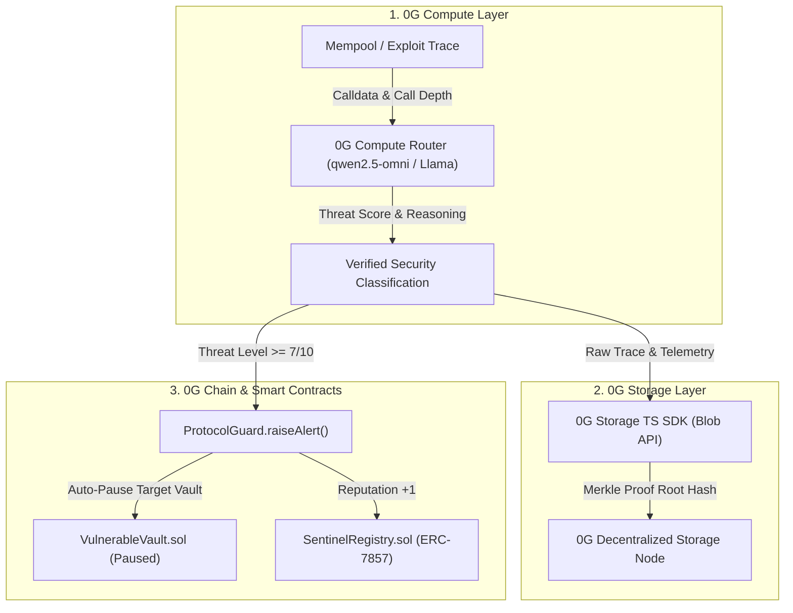
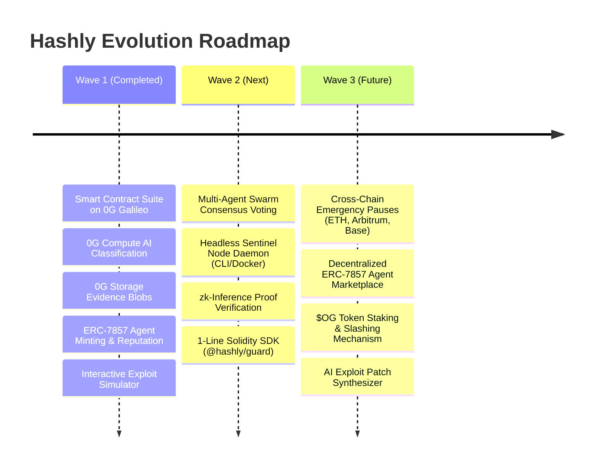

# 🛡️ Hashly — 0G Bridge Buildathon Submission Document (Wave 1)

> **Autonomous AI DeFi Security & Circuit Breaker Network on 0G**

---

## 📌 1. One-Liner Description

> **"Hashly is an autonomous on-chain security network that intercepts DeFi exploits in real time using 0G Compute for AI threat classification, 0G Storage for immutable evidence anchoring, and ERC-7857 Agentic IDs for automated circuit breakers on 0G Chain."**

---

## 📖 2. Detailed Project Description

DeFi exploits cost over **$2 Billion annually** in stolen liquidity. Reentrancy loops, flash loan price distortions, and oracle drift attacks execute in mere seconds. Existing security solutions rely on off-chain human monitoring and webhook alerts (e.g., Discord or Telegram bots) that take 15 to 45 minutes to triage — far too late to prevent catastrophic loss.

**Hashly** replaces passive off-chain alerts with an **autonomous, verifiable, closed-loop security infrastructure** built natively on the **0G Network**:

1. **Sub-Second AI Exploit Classification (0G Compute):** Raw EVM transaction execution traces (gas spikes, recursive call stack depths, state delta anomalies, and price slippage) are evaluated in real time by decentralized AI models running on the **0G Compute Router**.
2. **Immutable Forensic Storage (0G Storage):** Full exploit telemetry, transaction payloads, and model inference outputs are cryptographically hashed and permanently stored into **0G Storage** via `@0gfoundation/0g-storage-ts-sdk`, creating a tamper-proof audit trail with on-chain verifiable Merkle root hashes.
3. **Automated On-Chain Circuit Breakers (0G Chain):** When a threat exceeds the safety threshold ($\ge 7/10$), Hashly executes on-chain transaction calls to `ProtocolGuard.sol` on the **0G Galileo Testnet**, instantly pausing the target vulnerable vault within the same block.
4. **Decentralized Agentic Identities (ERC-7857):** Security agents are ownable, tokenized on-chain assets with dynamic system prompts and specializations. Each Sentinel earns reputation on 0G Chain based on verified detections, advancing through tiers: **Scout $\to$ Guardian $\to$ Warden $\to$ Overlord**.

---

## ⚡ 3. How We Use 0G's Technology (The 0G Full-Stack)

Hashly is built from the ground up across all four pillars of the 0G modular AI ecosystem:



| 0G Technology | Hashly Integration Details |
|---|---|
| **0G Compute Router** | Sub-second decentralized inference via OpenAI-compatible endpoint (`qwen2.5-omni` / Llama-4-Scout) to classify exploit signatures (reentrancy, flash loan manipulation, oracle drift, access control breaches) with provider and token usage billing telemetry. |
| **0G Storage** | Uploads tamper-proof JSON evidence blobs containing raw execution traces, model reasoning, and timestamps using `@0gfoundation/0g-storage-ts-sdk`. Returns on-chain verifiable Merkle root hashes. |
| **0G Chain (Galileo)** | High-throughput EVM blockchain (Chain ID `16602`) hosting `SentinelRegistry.sol`, `ProtocolGuard.sol`, and protected vaults with $<2\text{s}$ confirmation times. |
| **ERC-7857 Standard** | On-chain Agentic IDs with dynamic metadata URIs, behavioral system prompts, security specializations, and on-chain reputation tiering. |

---

## 📜 4. Deployed Smart Contracts (0G Galileo Testnet — Chain ID: 16602)

| Contract | Address on 0G Galileo | Description |
|---|---|---|
| **SentinelRegistry** (ERC-7857) | [`0x01F9d2D5A4eA2BA7139D599b4f6B6D06cCB34bcE`](https://chainscan-galileo.0g.ai/address/0x01F9d2D5A4eA2BA7139D599b4f6B6D06cCB34bcE) | Tokenized Agentic IDs with custom system prompts, specialization tracking, and on-chain reputation advancement. |
| **ProtocolGuard** (Circuit Breaker) | [`0x6224d82ab9bE92d4eCF116D8cafC13d078B83aFC`](https://chainscan-galileo.0g.ai/address/0x6224d82ab9bE92d4eCF116D8cafC13d078B83aFC) | Autonomous security hub that verifies threats, triggers emergency circuit-breaker pauses on target contracts, and updates sentinel reputation. |
| **VulnerableVault** (Demo Protocol) | [`0x67717afbCa0c2A4E060B2Ef0621bF33ef07908C5`](https://chainscan-galileo.0g.ai/address/0x67717afbCa0c2A4E060B2Ef0621bF33ef07908C5) | Live DeFi vault contract deployed on 0G Galileo containing a reentrancy vector to demonstrate active protection and autonomous pausing. |

---

## 🏆 5. What We Have Built in Wave 1

- [x] **Smart Contract Suite:** Deployed `SentinelRegistry` (ERC-7857), `ProtocolGuard`, and `VulnerableVault` to 0G Galileo Testnet.
- [x] **0G Compute Integration:** Live zero-shot AI exploit classification via 0G Compute Router (`qwen2.5-omni` with usage/billing trace telemetry).
- [x] **0G Storage Integration:** Live upload of forensic audit records and evidence JSONs via `@0gfoundation/0g-storage-ts-sdk`.
- [x] **ERC-7857 Agent Minting:** Configurable on-chain agent deployment with custom security specialization (Reentrancy, Flash Loan, Oracle, Access Control) and system prompts.
- [x] **Interactive Simulator:** End-to-end exploit simulator demonstrating mempool interception $\to$ 0G Compute $\to$ 0G Storage $\to$ On-chain circuit-breaker pause.
- [x] **Production dApp:** Minimalist, high-tech dark interface built with Next.js 15, RainbowKit, Wagmi v2, multi-RPC fallback support, and 100% on-chain live data.

---

## 🗺️ 6. Roadmap: Wave 2 & Wave 3



### 🚀 Wave 2: Swarm Consensus & Decentralized Sentinel Daemons
1. **Sentinel Swarm Consensus:** Multi-agent voting mechanism where $\ge 3$ independent Sentinel Agentic IDs must corroborate high-severity alerts before tripping global circuit breakers.
2. **Headless Sentinel Daemon (CLI / Docker):** Open-source background runner that protocol operators can run locally to monitor mempool transactions via WebSocket RPC.
3. **zk-Proof Verification:** Integrating zero-knowledge inference proofs verifying that 0G Compute outputs have not been tampered with before on-chain execution.
4. **Custom Protocol SDK (`@hashly/guard`):** A 1-line Solidity modifier `hashlyProtected` and npm package for third-party protocols on 0G to plug into the sentinel network.

### 🌐 Wave 3: Cross-Chain Settlement & Agent Marketplace
1. **Cross-Chain Circuit Breakers:** Cross-chain messaging allowing Sentinels on 0G Network to trigger emergency pauses on Ethereum, Arbitrum, and Base.
2. **ERC-7857 Agent Marketplace:** Decentralized marketplace to buy, rent, stake, and compose high-reputation Sentinel agents.
3. **Bounty & Slash Staking:** Staking mechanism where sentinel operators stake $OG tokens to earn detection bounties and face slashing for unverified false alarms.
4. **Automated Exploit Patch Synthesizer:** AI-generated Solidity hot-fix patches stored on 0G Storage alongside exploit reports.

---

## 🔍 7. Verified Live Test Artifacts

### 0G Compute Live Response:
```json
HTTP 200 OK
{
  "classification": "CRITICAL_REENTRANCY",
  "confidence": 0.95,
  "threatLevel": 8,
  "reasoning": "The function `withdraw` has multiple reentrancy calls detected within its execution flow.",
  "0g_trace": {
    "provider": "0xa48f01287233509FD694a22Bf840225062E67836",
    "request_id": "6a10850b-207a-4b3f-b172-dc413fdf2ba9",
    "total_cost": "700610000000000"
  },
  "model": "qwen2.5-omni",
  "usage": { "total_tokens": 128 }
}
```

---

## 📊 8. Buildathon Submission Metadata

- **Project Name:** Hashly
- **Track / Event:** 0G Bridge Buildathon by AKINDO
- **Wave:** Wave 1
- **GitHub Repository:** [https://github.com/ayush035/Hashly](https://github.com/ayush035/Hashly)
- **Target Network:** 0G Galileo Testnet (Chain ID `16602`)
- **Tags & Mentions:** `#0GBridge` `#BuildOn0G` `@0G_labs` `@0G_Builders` `@AKINDO_io`
