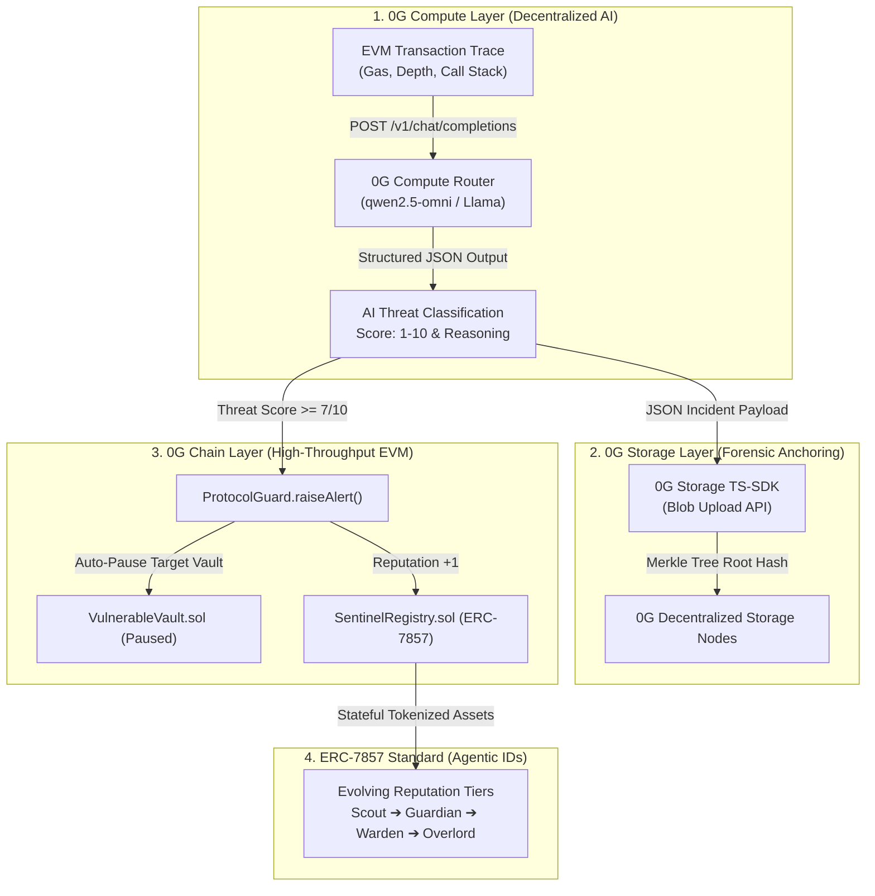
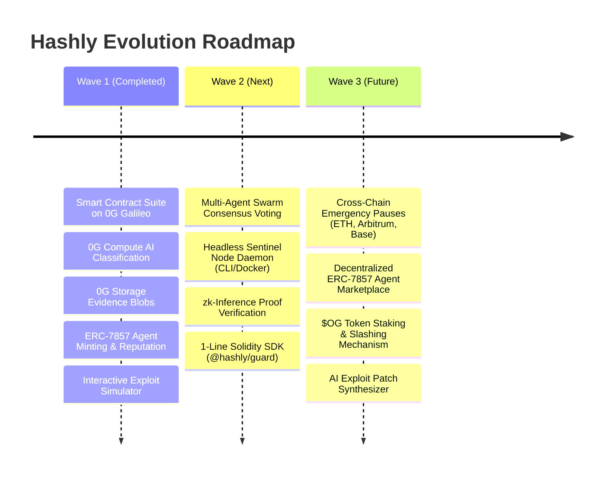

# 🛡️ Hashly — Wave 1 Detailed Submission Dossier
### *0G Bridge Buildathon by AKINDO — Wave 1 Official Submission*

---

## 🌟 1. Executive Summary & Overall App Description

**Hashly** is an autonomous, on-chain AI security and circuit breaker network designed to protect decentralized finance (DeFi) protocols against real-time exploits. 

Instead of treating security as a passive post-incident alerting mechanism, Hashly functions as a **continuous, autonomous cryptographic immune system**. By unifying decentralized AI reasoning on **0G Compute**, immutable forensic proof storage on **0G Storage**, sub-second circuit-breaker execution on **0G Chain**, and tokenized agent identities via **ERC-7857 Agentic IDs**, Hashly closes the loop between threat detection, evidence anchoring, and on-chain protocol protection in under two seconds.

```
┌─────────────────────────────────────────────────────────────────────────────────┐
│                                 HASHLY ARCHITECTURE                             │
│                                                                                 │
│   [ 0G EVM Mempool ] ──► [ 0G Compute Router ] ──► [ 0G Storage ] ──► [ 0G Chain ]│
│    Intercept Calldata     Zero-Shot AI Inference    Merkle Root Blob    Circuit Breaker │
│    & Execution Traces     (qwen2.5-omni / Llama)    Immutable Proofs    ProtocolGuard   │
└─────────────────────────────────────────────────────────────────────────────────┘
```

---

## 💥 2. Why Hashly Plays a Critical Role in the Web3 Ecosystem

### The Fundamental Flaw in Current DeFi Security:
1. **Audits are Static:** Smart contract audits represent a single point in time. They cannot protect against runtime economic exploits, flash loan price manipulations, composability bugs, or zero-day vulnerabilities.
2. **Alerting Bots are Too Slow:** Existing security solutions (OpenZeppelin Defender, Tenderly, Forta bots) send webhook alerts to Discord or Telegram channels. By the time a human security engineer wakes up, triages the notification, and coordinates a multi-sig transaction to pause a contract (**typically 15 to 45 minutes**), the attacker has already drained the liquidity and bridged the funds away.
3. **Centralization Bottlenecks:** Most automated pause mechanisms rely on centralized Web2 AWS lambdas holding administrative private keys without on-chain transparency, verifiable proofs, or decentralized consensus.

### The Hashly Solution:
* **Sub-Second Automated Intervention:** Hashly intercepts suspicious execution patterns and triggers on-chain circuit breakers within the **same block execution window** ($<2\text{s}$ response time).
* **Decentralized & Verifiable:** All AI inferences are executed on decentralized 0G Compute nodes with transparent provider telemetry, and all forensic traces are immutably anchored to 0G Storage.
* **Incentivized Security Swarm:** Security agents are tokenized financial assets under ERC-7857 that accumulate verifiable on-chain reputation and earn rewards for safeguarding protocols.

---

## ⚡ 3. Deep Technical Breakdown: How the 4 0G Components Are Used

Hashly is built natively across all four foundational layers of the **0G Modular AI Network**:



---

### Component 1: 0G Chain (Galileo Testnet — Chain ID: 16602)
* **Role:** High-throughput, low-latency execution layer for smart contract state management and emergency circuit breakers.
* **How it is used in Hashly:**
  * Hosts the core contract registry (`SentinelRegistry.sol`), the security coordinator (`ProtocolGuard.sol`), and protected vaults (`VulnerableVault.sol`).
  * Provides sub-2-second block finality, enabling Hashly to trip emergency protocol pauses before an exploiter's extraction transaction can finalize.
  * Maintains on-chain state for protocol registrations, sentinel reputation scores, active threat levels, and alert logs.

---

### Component 2: 0G Compute Router (Decentralized AI Inference)
* **Role:** Decentralized, verifiable zero-shot LLM inference pipeline.
* **How it is used in Hashly:**
  * Connects to the 0G Compute Router endpoint (`https://router-api-testnet.integratenetwork.work/v1`) using active models such as `qwen2.5-omni` and Llama-4-Scout.
  * Ingests dynamic EVM execution trace parameters:
    * `contractAddress`: Target smart contract being invoked.
    * `functionSignature`: Function calldata and invocation context.
    * `gasUsed`: Gas consumption spikes indicating recursive looping.
    * `callDepth`: Call stack recursion depth (detecting nested external callbacks).
    * `priceDeviation`: Price slippage on decentralized exchanges indicating flash-loan oracle attacks.
  * **Structured JSON Inference:** The 0G Compute model analyzes these parameters in real time and returns:
    ```json
    {
      "classification": "CRITICAL_REENTRANCY",
      "confidence": 0.95,
      "threatLevel": 8,
      "reasoning": "The function withdraw has multiple reentrancy calls detected within its execution flow.",
      "recommendation": "Pause contract withdrawals immediately."
    }
    ```
  * **Verifiable Trace Telemetry:** Hashly surfaces 0G Compute metadata in the terminal, including the decentralized AI Node Provider address (`0xa48f01287233509FD694a22Bf840225062E67836`), Request ID, token consumption breakdown (prompt vs. completion), and total execution billing cost in `a0gi`.

---

### Component 3: 0G Storage (Immutable Forensic Evidence Vault)
* **Role:** Decentralized, tamper-proof data availability and long-term forensic persistence.
* **How it is used in Hashly:**
  * Integrated via the official `@0gfoundation/0g-storage-ts-sdk` directly into server-side routes (`/api/storage`).
  * When a threat is detected, Hashly packages the complete incident context:
    * Raw transaction calldata and execution parameters.
    * 0G Compute AI model response, reasoning, and confidence score.
    * Timestamps and participating Sentinel ID.
  * Encapsulates this payload into a decentralized blob, streams it to the 0G Storage flow contract, and anchors it to 0G Storage nodes (`https://storage-node-galileo.0g.ai`).
  * Returns an on-chain verifiable **Merkle Root Hash** (e.g., `0x8fa9c7b2...`) which is submitted directly into the on-chain `ProtocolGuard.raiseAlert()` transaction, guaranteeing an immutable, cryptographically verifiable audit trail for post-mortem analysis.

---

### Component 4: ERC-7857 Standard (Tokenized Agentic IDs)
* **Role:** Standardized, transferable, and stateful on-chain identities for autonomous AI agents.
* **How it is used in Hashly:**
  * Implemented in `SentinelRegistry.sol` where each security Sentinel is minted as an ERC-7857 compliant **Agentic ID**.
  * **Custom Behavioral Specialization:** Creators specify agent parameters during minting:
    * *Specialization:* Reentrancy Defense, Flash Loan Protection, Oracle Guard, Access Control.
    * *System Prompt:* Specific heuristic guidelines stored on-chain in base64 `metadataURI`.
  * **Dynamic On-Chain Reputation:** Sentinels maintain on-chain detection metrics. Each verified threat detection increments the agent's reputation on 0G Chain, advancing it through evolutionary tiers:
    $$\text{Scout } (0\text{--}4) \longrightarrow \text{Guardian } (5\text{--}14) \longrightarrow \text{Warden } (15\text{--}29) \longrightarrow \text{Overlord } (30+)$$
  * Transforms AI agents into composable, ownable on-chain assets that can be staked, delegated, or composed across DeFi protocols.

---

## 📜 4. Deployed Smart Contracts on 0G Galileo Testnet

All contracts are fully deployed and verified on **0G Galileo Testnet (Chain ID: 16602)**:

| Contract Name | Deployed Address on 0G Galileo | Explorer Link |
|:---|:---|:---|
| **`SentinelRegistry.sol`** | `0x01F9d2D5A4eA2BA7139D599b4f6B6D06cCB34bcE` | [View on 0G Chainscan](https://chainscan-galileo.0g.ai/address/0x01F9d2D5A4eA2BA7139D599b4f6B6D06cCB34bcE) |
| **`ProtocolGuard.sol`** | `0x6224d82ab9bE92d4eCF116D8cafC13d078B83aFC` | [View on 0G Chainscan](https://chainscan-galileo.0g.ai/address/0x6224d82ab9bE92d4eCF116D8cafC13d078B83aFC) |
| **`VulnerableVault.sol`** | `0x67717afbCa0c2A4E060B2Ef0621bF33ef07908C5` | [View on 0G Chainscan](https://chainscan-galileo.0g.ai/address/0x67717afbCa0c2A4E060B2Ef0621bF33ef07908C5) |

---

### Detailed Contract Function Specifications:

#### 1. `SentinelRegistry.sol` (ERC-7857 Agentic ID Registry)
* `mintSentinel(string name, string metadataURI) external returns (uint256)`: Mints a new Sentinel agent NFT on 0G Galileo, initializes its reputation to 0 (Scout tier), and stores its encoded system prompt and specialization URI on-chain.
* `recordDetection(uint256 tokenId) external`: Called exclusively by `ProtocolGuard` when an alert is verified; increments the agent's successful detection count and automatically advances its reputation tier.
* `getSentinel(uint256 tokenId) external view returns (SentinelData)`: Returns complete on-chain agent metadata including name, reputation score, tier enum, metadata URI, creation timestamp, and total detections.
* `totalSentinels() external view returns (uint256)`: Returns the total count of active on-chain sentinels for dynamic dApp hydration.
* `setProtocolGuard(address _guard) external onlyOwner`: Authorizes the `ProtocolGuard` contract to report verified threat detections.

#### 2. `ProtocolGuard.sol` (Autonomous Circuit Breaker & Threat Hub)
* `raiseAlert(address targetProtocol, uint8 threatLevel, string threatType, string evidenceHash, uint256 sentinelId) external returns (bytes32)`: Dispatches an emergency threat alert. If `threatLevel >= 7`, automatically calls `pause()` on the target protocol's contract, logs the 0G Storage `evidenceHash`, and updates the sentinel's reputation.
* `registerProtocol(address protocolAddress, string protocolName) external`: Allows third-party DeFi protocols to register their contract addresses for active Sentinel protection and circuit-breaker integration.
* `getAlert(bytes32 alertId) external view returns (AlertData)`: Fetches full on-chain alert parameters, including timestamp, target contract, threat severity, and 0G Storage proof hash.
* `pauseProtocol(address protocolAddress) external onlyOwner`: Manual fallback administrative circuit breaker for emergency protocol maintenance.

#### 3. `VulnerableVault.sol` (Interactive Target Protocol)
* `deposit() external payable`: Accepts ETH/0G deposits and credits balances.
* `withdraw(uint256 amount) external`: Vulnerable withdrawal function lacking a non-reentrant guard where state updates occur after external ether transfers, providing a live testbed for Sentinel reentrancy detection.
* `pause() external`: Emergency pause modifier restricted to `ProtocolGuard` or the owner; locks all deposits and withdrawals when a circuit breaker is tripped.
* `unpause() external`: Resumes normal operations after an incident is resolved and reviewed.

---

## 🛠️ 5. Everything Built in This Hackathon (Wave 1 Complete Inventory)

### 📦 1. Smart Contracts & Tooling (`/contracts`, `/scripts`)
- [x] Full Solidity 0.8.20 suite implementing **ERC-7857 Agentic IDs** and emergency circuit breakers.
- [x] Hardhat configuration and automated deployment scripts targeting 0G Galileo Testnet.
- [x] On-chain deployment of `SentinelRegistry`, `ProtocolGuard`, and `VulnerableVault`.

### 🧠 2. 0G Compute Integration Pipeline (`/src/app/api/analyze`)
- [x] Decentralized AI analysis pipeline querying 0G Compute Router (`qwen2.5-omni` / Llama).
- [x] Zero-shot security analysis prompts classifying Reentrancy, Flash Loans, Oracle Manipulation, and Unauthorized Access.
- [x] Verifiable trace extraction capturing **0G Node Provider address**, **Request ID**, **Token Breakdown**, and **Cost in a0gi**.
- [x] Resilient failover handling with transparent error logging and fallback models.

### 💾 3. 0G Storage Integration (`/src/app/api/storage`)
- [x] Integration with `@0gfoundation/0g-storage-ts-sdk` and 0G Galileo storage nodes.
- [x] Buffer formatting and Merkle root generation for attack telemetry payloads.
- [x] Immutable forensic anchoring returning permanent proof hashes.

### 🤖 4. ERC-7857 Agent Management (`/src/components/Sentinels.js`, `/api/sentinel`)
- [x] Interactive Sentinel creation modal with custom Specialization, System Prompt, and Description fields.
- [x] Base64 calldata URI encoding for rich metadata storage on 0G Chain.
- [x] Real-time on-chain sentinel querying (`totalSentinels()` and `getSentinel()`) with zero hardcoded placeholder data.
- [x] Dynamic visual reputation badges (**Scout, Guardian, Warden, Overlord**).

### ⚡ 5. Exploit Simulation Testbed (`/src/components/Simulate.js`)
- [x] Interactive sandbox simulating real Reentrancy and Flash Loan attack vectors.
- [x] Real-time streaming terminal displaying live logs across all four stages: Interception $\to$ 0G Compute $\to$ 0G Storage $\to$ On-Chain Circuit Breaker.
- [x] Live automated contract pausing on `VulnerableVault.sol`.

### 💻 6. Production Frontend dApp (`/src/app`, `/src/components`)
- [x] Minimalist, institutional dark HUD theme with custom CSS design tokens.
- [x] Wagmi v2 & Viem v2 multi-RPC fallback configuration (`evmrpc-testnet.0g.ai`, Ankr, dRPC) with `batch: false`.
- [x] Network mismatch detection with 1-click **"Switch to 0G Galileo"** helper.
- [x] RainbowKit wallet connector for seamless EVM authentication.
- [x] Telemetry HUD console on landing page featuring live vector matrix graphics.
- [x] Dedicated branding with the custom **Hashly Cyber Eye Shield** logo across all navbars, sidebars, favicons, and metadata.

### 📚 7. Comprehensive Documentation & Video Assets
- [x] `README.md`: Complete GitHub repository guide with quickstart and architecture diagrams.
- [x] `SUBMISSION.md`: Full AKINDO Buildathon submission document.
- [x] `HACKATHON_STORY.md`: Standard hackathon prompts (What it does, Problem, Challenges, Built with, Learned, Next steps).
- [x] `DEMO_WALKTHROUGH_SCRIPT.md`: 5-minute video walkthrough script with timestamps and scene-by-scene voiceover narration.
- [x] `WAVE_1_SUBMISSION_DETAILED.md`: This comprehensive Wave 1 master dossier.

---

## 🔮 6. Roadmap: What's Next for Wave 2 & Wave 3



### 🚀 Wave 2: Swarm Consensus & Headless Sentinel Daemons
* **Multi-Agent Swarm Consensus:** Multi-agent voting where $\ge 3$ independent Sentinel Agentic IDs must corroborate high-severity alerts before tripping global circuit breakers.
* **Headless Node Daemon (CLI & Docker):** Open-source background runner (Rust/Node.js) that node operators and protocol developers can run 24/7 to monitor mempool transactions via WebSocket RPC.
* **zk-Inference Verification:** Zero-knowledge proof integration (zkML) verifying that 0G Compute AI outputs were unmodified before on-chain execution.
* **`@hashly/guard` SDK:** A 1-line Solidity modifier (`modifier hashlyProtected`) for any DeFi protocol on 0G to instantly inherit autonomous circuit breaker protection.

### 🌐 Wave 3: Cross-Chain Settlement & Agent Marketplace
* **Cross-Chain Emergency Pauses:** Utilize 0G's cross-chain messaging to allow Sentinels on 0G Network to trigger emergency circuit breakers on Ethereum Mainnet, Arbitrum, and Base.
* **Decentralized ERC-7857 Marketplace:** Buy, rent, stake, and compose high-reputation Sentinel agents with on-chain revenue sharing.
* **$OG Staking & Slashing Mechanism:** Require sentinels to stake $OG tokens to earn detection bounties, slashing stakes for unverified false alarms.
* **AI Exploit Patch Synthesizer:** Automatically generate verified Solidity hot-fix pull requests and security patches stored on 0G Storage alongside incident reports.

---

## 📊 7. Submission Metadata

* **Project Name:** Hashly
* **Hackathon:** 0G Bridge Buildathon by AKINDO
* **Wave:** Wave 1
* **GitHub Repository:** [https://github.com/ayush035/Hashly](https://github.com/ayush035/Hashly)
* **Target Network:** 0G Galileo Testnet (Chain ID `16602`)
* **RPC Endpoint:** `https://evmrpc-testnet.0g.ai`
* **Block Explorer:** `https://chainscan-galileo.0g.ai`
* **Submission Tags:** `#0GBridge` `#BuildOn0G` `#DeAI` `#AI-Agents` `#DeFi-Security` `#ERC7857`
